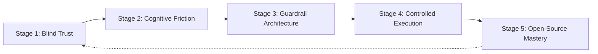
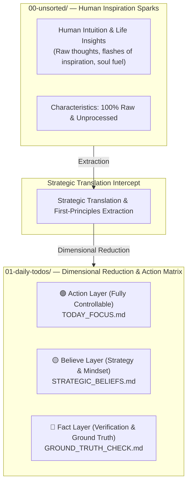

# 🛡️ "Don't let AI run amok on your codebase. Enforce Plan-First Cognitive Guardrails with P-Gate."

> 🌐 **Languages**: [English](README.md) | [簡體中文](README_CN.md) | [繁體中文](README_ZH_TW.md) | [日本語](README_JA.md) | [한국어](README_KO.md) | [ภาษาไทย](README_TH.md) | [Bahasa Indonesia](README_ID.md) | [Tiếng Việt](README_VN.md)

### **Santenmoku P-Gate Protocol**

*Human-Machine Cognitive Guardrails, Anti-Hallucination Intercepts & Zero-Trust Safety Protocol for AI Agents.*

> 🕊️ **Tolerance & Control**: Among our Big 4 design principles, the 4th is **Tolerance**. The AI Agent exists to absorb the costs of trial and error and the burden of execution for humans, not to put them under mental strain. With P-Gate, control always remains in human hands!

> 🖥️ **Interactive Live UI Demo**: Experience the 4-Stage Cognitive Intercept HUD directly in your browser:
> 👉 **[Launch Santenmoku P-Gate HUD Demo (`docs/p-gate-demo.html`)](./docs/p-gate-demo.html)**

## 🚀 Quickstart: How to Protect Your Codebase in 30 Seconds

Choose the deployment method that fits your workflow:

### Option A: One-Line CLI Bootstrapper (Recommended)
Run the automated seed loader inside your terminal to choose your primary language (EN, CN, ZH_TW, JA, KO, TH, ID, VN) and lock down your AI Agent:

```bash
./bin/seed-init.sh
# Or if using npm scripts:
npm run seed:init
```

---

## 🎯 What is P-Gate?

> 💡 **P-Gate (Plan-First & Cognitive Guardrail Protocol)**: A zero-trust safety and cognitive defense framework engineered for human-AI agent collaboration.

For developers and users new to the protocol, the **"P" in P-Gate stands for 3 Core Pillars (The 3 Pillars of P)**, designed layer-by-layer to preserve human intent and control:

1. **Plan-First**:
   * Rejects unprompted AI mutations or silent file edits. Every state change requires a structured execution plan approved by the human before write access is granted.
2. **Psychological Safety**:
   * Eliminates anxiety through 100% reversible Step 0 Pre-flight Snapshots and instant freeze triggers (`Esc` / `Hold, let me think.`), granting the human absolute freedom to experiment without risk.
3. **P-Gate Cognitive Intercepts**:
   * Enforces structured multi-stage confirmation gates (Lv.0 to Lv.3) at critical decision checkpoints (state writes, deployment, and hotkey signing) to ensure true human-machine alignment.

* **Not a rigid blocker**: P-Gate is a psychological safety net that ensures sovereignty remains permanently in human hands.
* **True Delegation**: It offloads the mental strain of trial and error to the AI Agent, returning a calm, deterministic decision-making space back to the developer.

---

## 🌊 The Hidden Ladders: From Blind Trust to Engineered Mastery

> *"Progress is never a straight line. Between 'Ignorance' and 'Mastery' lie the unmapped reefs of real-world cognitive friction."*

Most engineering teams foolishly assume that AI adoption follows a simple 3-step linear path: **Ignorance ➔ Execution ➔ Mastery**.

In reality, production-grade AI engineering requires navigating five critical, often overlooked evolutionary stages:




---


### 🧗 The 5 Evolutionary Stages of Human-AI Alignment

1. **Unconscious Incompetence (Blind Trust)**
  - *The Pitfall*: Naïvely trusting AI agents without safety constraints, assuming a simple prompt will yield perfect production code.
2. **Cognitive Friction (The Wall of Anxiety)**
  - *The Friction*: Experiencing AI hallucinations, unprompted file mutations, countdown timer pressure, and constant fear of issuing bad guidance.
3. **Guardrail Architecture (Boundaries & Fail-Safe)**
  - *The Epiphany*: Realizing the non-negotiable need for Step 0 Git Pre-flight Snapshots, Plan-First enforcement, and P-Gate cognitive intercepts.
4. **Controlled Execution (Predictable Command)**
  - *The Mastery*: Seamlessly steering AI agents through structured multi-step plans with 100% deterministic control and instant reversibility.
5. **Productization & Open-Source Mastery (Public Good)**
  - *The Pinnacle*: Abstracting painful, real-world battle lessons into standardized cognitive protocols — turning internal guardrails into a global public good via **Santenmoku P-Gate Protocol**.


## 🧬 SilverVine Human-to-Machine Interactive Pipeline

> 💡 **From Raw Intuition to Controlled Execution**: How human spark transforms into engineered ground truth through Santenmoku P-Gate intercepts.




☕ Human Control & Freeze Rule

💡 P-Gate Core Cognitive Barrier: Under the Santenmoku system, humans possess "unlimited corrective power." You have absolutely no need to fear incorrect guidance; the system's underlying layers have multiple backups and dimensional reduction defenses, ensuring 100% tolerance!

🛡️ Three Psychological & Safety Nets

Zero Time Pressure:

You always have ultimate control. If you feel your thoughts are unclear or you're worried about not thinking thoroughly enough when faced with a 5-minute countdown or an A/B multiple-choice question, this is perfectly normal. Do not make hasty decisions.

Instant Freeze:

Simply press Esc or type "Hold, let me think." in the dialog box, and the AI ​​Agent will immediately freeze all execution and enter a waiting state.

100% Reversible:

The system is backed by a Step 0 Git Pre-flight Snapshot, ensuring one-click recovery from any step (git reset), eliminating the risk of trial and error.

🤝 Human-in-the-Loop:

Automatic Fail-Safe Downgrade:

If no human intervention or switch occurs within the specified countdown timer, the AI ​​Agent will automatically trigger a safe downgrade, forcibly switching to Plan Mode, never modifying the code arbitrarily.

Perfect Co-Op Loop:

The machine automatically enters Plan Mode ➔ produces a structured Plan ➔ Human approval ➔ Machine begins precise execution.