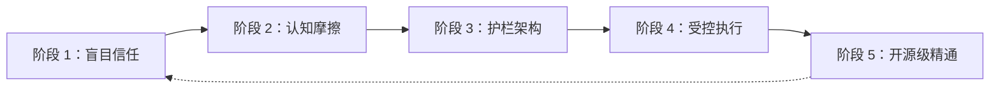
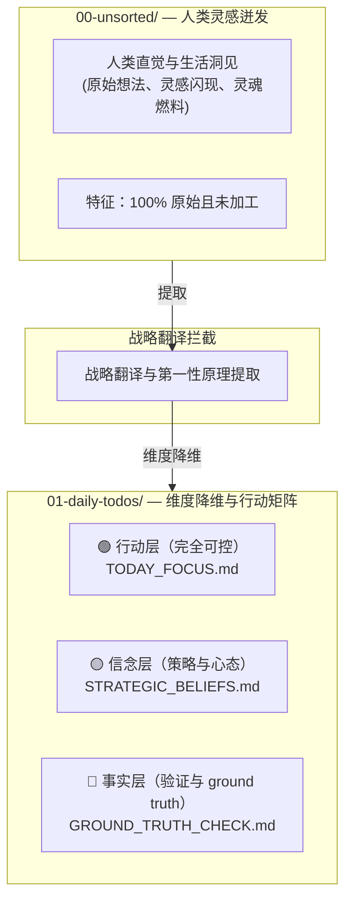

# 🛡️ “别让 AI 在你的代码库里失控。用 P-Gate 执行 Plan-First 认知护栏。”

> 🌐 **Languages**: [English](README.md) | [簡體中文](README_CN.md) | [繁體中文](README_ZH_TW.md) | [日本語](README_JA.md) | [한국어](README_KO.md) | [ภาษาไทย](README_TH.md) | [Bahasa Indonesia](README_ID.md) | [Tiếng Việt](README_VN.md)

### **Santenmoku P-Gate Protocol**

*面向 AI Agent 的人机认知护栏、幻觉拦截与零信任安全协议。*

> 🕊️ **容忍与控制**：在我们的四大设计原则中，第 4 项是 **容忍**。AI Agent 的存在，是为了替人类承担试错成本和执行负担，而不是让人类承受精神压力。借助 P-Gate，控制权始终掌握在人类手中！

> 🖥️ **交互式实体 UI Demo**：直接在浏览器中体验 4 阶认知拦截 HUD 界面：
> 👉 **[启动 Santenmoku P-Gate HUD Demo (`docs/p-gate-demo.html`)](./docs/p-gate-demo.html)**

## 🚀 快速上手：30 秒内保护你的代码库

选择最适合你的工作流的部署方式：

### 选项 A：一键 CLI 启动器（推荐）
在终端中运行自动化种子加载器，选择你的主语言（EN, CN, ZH_TW, JA, KO, TH, ID, VN），并锁定你的 AI Agent：

```bash
./bin/seed-init.sh
# 如果使用 npm 脚本：
npm run seed:init
```

---

## 🎯 什么是 P-Gate？

> 💡 **P-Gate (Plan-First & Cognitive Guardrail Protocol)**：一种为人类与 AI Agent 协作而设计的零信任安全与认知防御框架。

对于刚接触该协议的开发者和用户来说，P-Gate 中的 **“P”** 代表 3 个核心支柱（The 3 Pillars of P），其设计采用分层方式，以维护人类意图与控制权：

1. **Plan-First**：
   * 拒绝未经请求的 AI 变更或静默文件编辑。任何状态变更都必须先由人类批准一份结构化执行计划，然后才会授予写入权限。
2. **心理安全**：
   * 借助 100% 可逆的 Step 0 Pre-flight Snapshots 和即时冻结触发器（`Esc` / `Hold, let me think.`），消除焦虑，让人类可以无风险地自由试验。
3. **P-Gate 认知拦截**：
   * 在关键决策检查点（状态写入、部署和热键签名）实施结构化的多阶段确认闸门（Lv.0 至 Lv.3），确保真正的人机一致。

* **不是僵硬的阻断器**：P-Gate 是一道心理安全网，确保主权始终永久掌握在人类手中。
* **真正的委派**：它把试错带来的心理负担交给 AI Agent 承担，把冷静、确定性的决策空间还给开发者。

---

## 🌊 隐藏的阶梯：从盲目信任到工程化精通

> *“进步从来不是一条直线。在‘无知’与‘精通’之间，横亘着现实世界里未被绘制的认知摩擦暗礁。”*

许多工程团队天真地认为，AI 采用会遵循一条简单的 3 步线性路径：**无知 ➔ 执行 ➔ 精通**。

但现实中，生产级 AI 工程需要穿越五个关键、却常被忽视的演化阶段：




---


### 🧗 人类与 AI 对齐的 5 个演化阶段

1. **无意识低能（盲目信任）**
  - *陷阱*：天真地信任没有安全约束的 AI Agent，认为只要一个 prompt 就能生成完美的生产代码。
2. **认知摩擦（焦虑之墙）**
  - *阻力*：遭遇 AI 幻觉、未经请求的文件变更、倒计时压力，以及持续担心给出错误指引的恐惧。
3. **护栏架构（边界与故障安全）**
  - *顿悟*：意识到 Step 0 Git Pre-flight Snapshots、Plan-First 强制执行和 P-Gate 认知拦截的不可妥协必要性。
4. **受控执行（可预测命令）**
  - *精通*：通过结构化的多步骤计划无缝引导 AI Agent，实现 100% 确定性控制与即时可逆性。
5. **产品化与开源级精通（公共福祉）**
  - *巅峰*：将痛苦的真实战场经验抽象为标准化认知协议，通过 **Santenmoku P-Gate Protocol** 把内部护栏转化为全球公共福祉。


## 🧬 SilverVine 人机交互流水线

> 💡 **从原始直觉到受控执行**：人类火花如何通过 Santenmoku P-Gate 拦截，转化为工程化的 ground truth。




☕ 人类控制与冻结规则

💡 P-Gate 核心认知屏障：在 Santenmoku 系统下，人类拥有“无限纠错能力”。你完全不必害怕错误指令；系统底层拥有多重备份和维度降维防线，确保 100% 容忍！

🛡️ 三重心理与安全护栏

零时间压力：

无论何时，你都拥有最终控制权。当面对 5 分钟倒计时或 A/B 选择题时，如果你觉得思路不清晰，或者担心自己还没想透，这是完全正常的。不要仓促做决定。

即时冻结：

只需按下 Esc，或在对话框中输入 "Hold, let me think."，AI Agent 就会立即冻结所有执行并进入等待状态。

100% 可逆：

系统由 Step 0 Git Pre-flight Snapshot 作为后盾，确保可通过 git reset 一键从任何步骤恢复，消除试错风险。

🤝 人在回路中：

自动安全降级：

如果在指定倒计时内没有人工干预或切换，AI Agent 将自动触发安全降级，强制切换到 Plan Mode，绝不会擅自修改代码。

完美协作循环：

机器自动进入 Plan Mode ➔ 生成结构化 Plan ➔ 人工批准 ➔ 机器开始精确执行。
