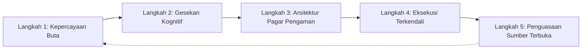
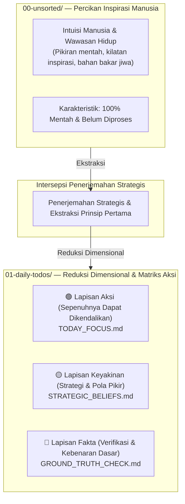

# 🛡️ "Jangan biarkan AI mengamuk di basis kode Anda. Tegakkan Plan-First Cognitive Guardrails dengan P-Gate."

> 🌐 **Languages**: [English](README.md) | [簡體中文](README_CN.md) | [繁體中文](README_ZH_TW.md) | [日本語](README_JA.md) | [한국어](README_KO.md) | [ภาษาไทย](README_TH.md) | [Bahasa Indonesia](README_ID.md) | [Tiếng Việt](README_VN.md)

### **Santenmoku P-Gate Protocol**

*Pagar Pengaman Kognitif Manusia-Mesin, Intersepsi Anti-Halusinasi, dan Protokol Keselamatan Zero-Trust untuk Agen AI.*

> 🕊️ **Toleransi & Kontrol**: Di antara empat prinsip desain utama kami, yang ke-4 adalah **Toleransi**. Agen AI ada untuk menyerap biaya coba-coba dan beban eksekusi bagi manusia, bukan untuk membebani mereka secara mental. Dengan P-Gate, kendali selalu tetap di tangan manusia!

## 🚀 Quickstart: Cara Melindungi Basis Kode Anda dalam 30 Detik

Pilih metode penerapan yang sesuai dengan alur kerja Anda:

### Opsi A: Bootstrapper CLI Satu Baris (Disarankan)
Jalankan pemuat seed otomatis di terminal Anda untuk memilih bahasa utama Anda (EN, CN, ZH_TW, JA, KO, TH, ID, VN) dan mengunci Agen AI Anda:

```bash
./bin/seed-init.sh
# Atau jika menggunakan skrip npm:
npm run seed:init
```

---

## 🎯 Apa itu P-Gate?

> 💡 **P-Gate (Plan-First & Cognitive Guardrail Protocol)**: Kerangka kerja keselamatan zero-trust dan pertahanan kognitif yang dirancang untuk kolaborasi manusia dan agen AI.

Bagi pengembang dan pengguna yang baru mengenal protokol ini, **"P" dalam P-Gate berarti 3 Pilar Inti (3 Pilar P)**, yang dirancang berlapis-lapis untuk menjaga niat dan kendali manusia:

1. **Plan-First**:
   * Menolak mutasi AI yang tidak diminta atau pengeditan file diam-diam. Setiap perubahan keadaan memerlukan rencana eksekusi terstruktur yang disetujui oleh manusia sebelum akses tulis diberikan.
2. **Keamanan Psikologis**:
   * Menghilangkan kecemasan melalui Step 0 Git Pre-flight Snapshot yang 100% dapat dibalik dan pemicu pembekuan instan (`Esc` / `Hold, let me think.`), sehingga manusia memperoleh kebebasan penuh untuk bereksperimen tanpa risiko.
3. **P-Gate Cognitive Intercepts**:
   * Menerapkan gerbang konfirmasi multi-tahap terstruktur (Lv.0 hingga Lv.3) pada titik pengambilan keputusan kritis (penulisan state, deployment, dan hotkey signing) untuk memastikan penyelarasan manusia-mesin yang sesungguhnya.

* **Bukan penghalang kaku**: P-Gate adalah jaring pengaman psikologis yang memastikan kedaulatan tetap permanen di tangan manusia.
* **Delegasi Sejati**: P-Gate meringankan beban mental dari coba-coba kepada Agen AI, lalu mengembalikan ruang pengambilan keputusan yang tenang dan deterministik kepada pengembang.

---

## 🌊 Tangga Tersembunyi: Dari Kepercayaan Buta ke Penguasaan Rekayasa

> *"Kemajuan tidak pernah berupa garis lurus. Di antara 'Ketidaktahuan' dan 'Penguasaan' terhampar karang-karang gesekan kognitif dunia nyata yang belum dipetakan."*

Sebagian besar tim rekayasa keliru menganggap adopsi AI mengikuti jalur linear tiga langkah yang sederhana: **Ketidaktahuan ➔ Eksekusi ➔ Penguasaan**.

Pada kenyataannya, rekayasa AI kelas produksi menuntut penelusuran melalui lima tahap evolusioner penting yang sering diabaikan:




---


### 🧗 5 Tahap Evolusioner Penyelarasan Manusia-AI

1. **Ketidakmampuan Tak Sadar (Kepercayaan Buta)**
  - *Jebakan*: Mempercayai agen AI secara naif tanpa batasan keselamatan, dengan asumsi prompt sederhana akan menghasilkan kode produksi yang sempurna.
2. **Gesekan Kognitif (Dinding Kecemasan)**
  - *Gesekan*: Mengalami halusinasi AI, mutasi file yang tidak diminta, tekanan hitung mundur, dan ketakutan terus-menerus karena memberi arahan yang buruk.
3. **Arsitektur Pagar Pengaman (Batas & Fail-Safe)**
  - *Pencerahan*: Menyadari kebutuhan yang tidak dapat ditawar untuk Step 0 Git Pre-flight Snapshot, penegakan Plan-First, dan intersepsi kognitif P-Gate.
4. **Eksekusi Terkendali (Perintah yang Dapat Diprediksi)**
  - *Kepiawaian*: Mengarahkan agen AI dengan mulus melalui rencana multi-langkah terstruktur dengan kendali deterministik 100% dan kemampuan pembalikan instan.
5. **Produktisasi & Penguasaan Sumber Terbuka (Kebaikan Publik)**
  - *Puncak*: Mengabstraksikan pelajaran keras dunia nyata menjadi protokol kognitif terstandar - mengubah pagar pengaman internal menjadi kebaikan publik global melalui **Santenmoku P-Gate Protocol**.


## 🧬 Pipeline Interaktif Manusia-ke-Mesin SilverVine

> 💡 **Dari Intuisi Mentah ke Eksekusi Terkendali**: Bagaimana percikan manusia berubah menjadi kebenaran dasar yang direkayasa melalui intersepsi P-Gate Santenmoku.




☕ Kontrol Manusia & Aturan Pembekuan

💡 Penghalang Kognitif Inti P-Gate: Dalam sistem Santenmoku, manusia memiliki "kekuatan korektif tak terbatas." Anda sama sekali tidak perlu takut pada arahan yang keliru; lapisan dasar sistem memiliki banyak cadangan dan pertahanan reduksi dimensional, sehingga menjamin toleransi 100%!

🛡️ Tiga Jaring Pengaman Psikologis & Keselamatan

Tekanan Waktu Nol:

Anda selalu memiliki kendali tertinggi. Jika Anda merasa pikiran Anda belum jelas atau khawatir belum cukup matang saat menghadapi hitung mundur 5 menit atau pertanyaan pilihan ganda A/B, itu sepenuhnya normal. Jangan mengambil keputusan tergesa-gesa.

Pembekuan Instan:

Cukup tekan Esc atau ketik "Hold, let me think." di kotak dialog, dan Agen AI akan segera membekukan seluruh eksekusi dan masuk ke status menunggu.

100% Dapat Dibalik:

Sistem ini didukung oleh Step 0 Git Pre-flight Snapshot, yang memastikan pemulihan satu klik dari tahap mana pun (git reset), sehingga menghilangkan risiko coba-coba.

🤝 Manusia dalam Siklus:

Penurunan Fail-Safe Otomatis:

Jika tidak ada intervensi atau perpindahan manusia dalam batas waktu hitung mundur yang ditentukan, Agen AI akan secara otomatis memicu penurunan aman, secara paksa beralih ke Plan Mode, dan tidak akan mengubah kode secara sembarangan.

Siklus Ko-Op Sempurna:

Mesin secara otomatis masuk ke Plan Mode ➔ menghasilkan Plan terstruktur ➔ Persetujuan manusia ➔ Mesin memulai eksekusi yang presisi.
