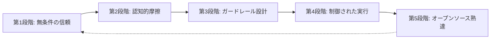
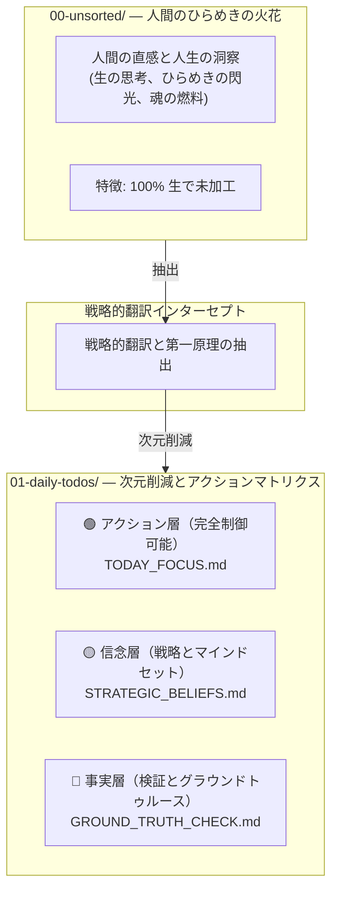

# 🛡️ 「AIにコードベースで暴走させない。P-Gateで Plan-First の認知ガードレールを徹底する。」

> 🌐 **Languages**: [English](README.md) | [簡體中文](README_CN.md) | [繁體中文](README_ZH_TW.md) | [日本語](README_JA.md) | [한국어](README_KO.md) | [ภาษาไทย](README_TH.md) | [Bahasa Indonesia](README_ID.md) | [Tiếng Việt](README_VN.md)

### **Santenmoku P-Gate Protocol**

*AIエージェントのための、人間機械間の認知ガードレール、幻覚抑止インターセプト、およびゼロトラスト安全プロトコル。*

> 🕊️ **寛容性と統制**: Big 4 の設計原則のうち第4の原則は **寛容性** です。AIエージェントは、試行錯誤に伴うコストや実行の負担を人間の代わりに引き受ける存在であり、人間に精神的な負荷を与えるためのものではありません。P-Gate により、統制は常に人間の手元に残ります。

> 🖥️ **インタラクティブ Live UI デモ**：4段階の認知インターセプト HUD をブラウザで直接体験できます：
> 👉 **[Santenmoku P-Gate HUD Demo を起動 (`docs/p-gate-demo.html`)](./docs/p-gate-demo.html)**

## 🚀 クイックスタート: 30秒でコードベースを保護する方法

ワークフローに合う導入方法を選んでください。

### オプションA: 1行CLIブートストラッパー（推奨）
端末で自動シードローダーを実行し、主要言語（EN, CN, ZH_TW, JA, KO, TH, ID, VN）を選んで AI エージェントをロックダウンします。

```bash
./bin/seed-init.sh
# または npm スクリプトを使う場合:
npm run seed:init
```

---

## 🎯 P-Gateとは？

> 💡 **P-Gate（Plan-First & Cognitive Guardrail Protocol）**: 人間とAIエージェントの協働のために設計された、ゼロトラストの安全および認知防御フレームワークです。

このプロトコルを初めて扱う開発者やユーザーに向けて、**P-Gate の「P」は 3 つの中核的支柱（The 3 Pillars of P）** を意味します。人間の意図と統制を層ごとに守るよう設計されています。

1. **Plan-First**:
   * 事前に求められていない AI の変更や、黙って行われるファイル編集を拒否します。あらゆる状態変更は、書き込み権限が与えられる前に、人間が承認した構造化された実行計画を必要とします。
2. **心理的安全性**:
   * 100% 取り消し可能な Step 0 Git Pre-flight Snapshot と、即時フリーズトリガー（`Esc` / `Hold, let me think.`）によって不安を排除し、人間がリスクなく自由に試行できる状態を保証します。
3. **P-Gate の認知インターセプト**:
   * 重要な意思決定ポイント（状態書き込み、デプロイ、ホットキー署名）において、構造化された多段階の確認ゲート（Lv.0 から Lv.3）を強制し、真の人間機械整合を確保します。

* **硬直したブロッカーではない**: P-Gate は、人間の主権が恒久的に人間の手に残ることを保証する、心理的な安全ネットです。
* **真の委任**: 試行錯誤に伴う精神的負荷を AI エージェントに引き受けさせ、落ち着いた決定論的な意思決定空間を開発者へ取り戻します。

---

## 🌊 見えないはしご: 無条件の信頼から設計された熟達へ

> *「進歩は決して一直線ではない。『無知』と『熟達』のあいだには、現実世界の認知的摩擦という未踏の岩礁が横たわっている。」*

多くのエンジニアリングチームは、AI 導入が **無知 ➔ 実行 ➔ 熟達** という単純な 3 段階の直線的な道筋をたどると、安易に考えがちです。

実際には、本番品質の AI エンジニアリングには、見落とされがちだが極めて重要な 5 つの進化段階をたどる必要があります。




---


### 🧗 人間とAIの整合における 5 つの進化段階

1. **無意識的無能（Blind Trust）**
  - *落とし穴*: 安全制約なしに AI エージェントを無邪気に信頼し、単純なプロンプトだけで本番品質のコードが完璧に得られると考えてしまうこと。
2. **認知的摩擦（不安の壁）**
  - *摩擦*: AI の幻覚、意図しないファイル改変、カウントダウンタイマーの圧力、そして誤った指示を出すことへの絶え間ない不安を経験すること。
3. **ガードレール設計（境界とフェイルセーフ）**
  - *気づき*: Step 0 Git Pre-flight Snapshots、Plan-First の強制、P-Gate の認知インターセプトが交渉不可能な要件であると理解すること。
4. **制御された実行（予測可能な命令）**
  - *熟達*: 構造化された複数ステップの計画を通じて AI エージェントを滑らかに誘導し、100% 決定論的な統制と即時の可逆性を実現すること。
5. **製品化とオープンソース熟達（公共善）**
  - *頂点*: 現場で得た痛みを伴う実戦知を標準化された認知プロトコルへ抽象化し、**Santenmoku P-Gate Protocol** を通じて内部のガードレールを世界的な公共財へ変えること。


## 🧬 SilverVine 人間-機械インタラクティブ・パイプライン

> 💡 **生の直感から制御された実行へ**: 人間のひらめきが、Santenmoku P-Gate のインターセプトを通じて設計されたグラウンドトゥルースへと変換される仕組みです。




☕ 人間の統制とフリーズ規則

💡 P-Gate の中核認知バリア: Santenmoku システムの下では、人間は「無制限の修正権限」を持ちます。誤った指示を恐れる必要はまったくありません。基盤層には複数のバックアップと次元削減の防御が備わっており、100% の寛容性が保証されています。

🛡️ 3つの心理的・安全ネット

時間的圧力ゼロ:

あなたは常に最終的な統制権を持っています。5 分のカウントダウンや A/B の多肢選択式の問いに直面したとき、思考が曖昧だったり、十分に考えられていないのではないかと不安になったりしても、それはまったく正常です。性急な判断はしないでください。

即時フリーズ:

ダイアログボックスで Esc を押すか、「Hold, let me think.」と入力するだけで、AI Agent はすべての実行を直ちに停止し、待機状態に入ります。

100% 可逆:

このシステムは Step 0 Git Pre-flight Snapshot によって支えられており、あらゆる段階からワンクリックで復旧できます（git reset）。試行錯誤のリスクを排除します。

🤝 Human-in-the-Loop:

自動フェイルセーフのダウングレード:

指定されたカウントダウンタイマー内に人間の介入や切り替えが行われない場合、AI Agent は自動的に安全なダウングレードを発火し、強制的に Plan Mode へ切り替えて、コードを勝手に変更しません。

完全な協働ループ:

マシンは自動的に Plan Mode に入り ➔ 構造化された Plan を作成 ➔ 人間が承認 ➔ マシンが正確な実行を開始します。
