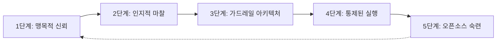
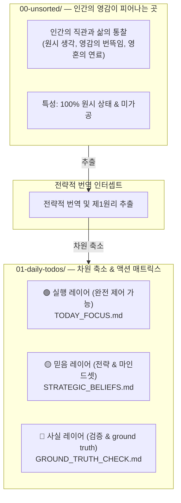

# 🛡️ "AI가 코드베이스를 제멋대로 흔들지 못하게 하세요. P-Gate로 Plan-First 인지 가드레일을 강제하세요."

> 🌐 **Languages**: [English](README.md) | [簡體中文](README_CN.md) | [繁體中文](README_ZH_TW.md) | [日本語](README_JA.md) | [한국어](README_KO.md) | [ภาษาไทย](README_TH.md) | [Bahasa Indonesia](README_ID.md) | [Tiếng Việt](README_VN.md)

### **Santenmoku P-Gate Protocol**

*인간-기계 인지 가드레일, 환각 차단 인터셉트, 그리고 AI Agent를 위한 제로 트러스트 안전 프로토콜.*

> 🕊️ **Tolerance & Control**: Big 4 설계 원칙 가운데 네 번째는 **Tolerance**입니다. AI Agent는 인간에게 정신적 부담을 주는 존재가 아니라, 시행착오의 비용과 실행의 부담을 대신 떠안는 존재입니다. P-Gate에서는 통제권이 언제나 인간의 손에 남아 있습니다!

> 🖥️ **인터랙티브 라이브 UI 데모**: 브라우저에서 4단계 인지 인터셉트 HUD를 직접 체험해 보세요:
> 👉 **[Santenmoku P-Gate HUD Demo 실행 (`docs/p-gate-demo.html`)](./docs/p-gate-demo.html)**

## 🚀 30초 만에 코드베이스를 보호하는 Quickstart

작업 흐름에 맞는 배포 방식을 선택하세요:

### Option A: One-Line CLI Bootstrapper (Recommended)
터미널에서 자동 시드 로더를 실행해 기본 언어(EN, CN, ZH_TW, JA, KO, TH, ID, VN)를 선택하고 AI Agent를 잠그세요:

```bash
./bin/seed-init.sh
# Or if using npm scripts:
npm run seed:init
```

---

## 🎯 What is P-Gate?

> 💡 **P-Gate (Plan-First & Cognitive Guardrail Protocol)**: 인간-AI 에이전트 협업을 위해 설계된 제로 트러스트 안전 및 인지 방어 프레임워크입니다.

이 프로토콜을 처음 접하는 개발자와 사용자를 위해, **P-Gate의 "P"는 3개의 핵심 기둥(The 3 Pillars of P)** 을 뜻하며, 인간의 의도와 통제권을 지키도록 층층이 설계되어 있습니다:

1. **Plan-First**:
   * 사전 요청 없는 AI 변경이나 조용한 파일 수정을 거부합니다. 모든 상태 변경은 쓰기 권한이 부여되기 전에 인간이 승인한 구조화된 실행 계획을 요구합니다.
2. **Psychological Safety**:
   * `Esc` / `Hold, let me think.`를 통한 즉시 freeze 트리거와 100% 되돌릴 수 있는 Step 0 Pre-flight Snapshots로 불안을 제거해, 인간이 위험 없이 자유롭게 실험할 수 있게 합니다.
3. **P-Gate Cognitive Intercepts**:
   * 핵심 의사결정 지점(state writes, deployment, hotkey signing)에서 구조화된 다단계 확인 게이트(Lv.0 to Lv.3)를 강제해 진정한 인간-기계 정렬을 보장합니다.

* **Not a rigid blocker**: P-Gate는 주권이 영구히 인간의 손에 남도록 보장하는 심리적 안전망입니다.
* **True Delegation**: 시행착오로 인한 정신적 부담을 AI Agent에게 넘기고, 개발자에게 다시 차분하고 결정론적인 의사결정 공간을 돌려줍니다.

---

## 🌊 숨겨진 사다리: 맹목적 신뢰에서 설계된 숙련으로

> *"진보는 결코 직선이 아닙니다. '무지'와 '숙련' 사이에는 실제 세계의 인지적 마찰이라는 미지의 암초가 놓여 있습니다."*

대부분의 엔지니어링 팀은 AI 도입이 단순한 3단계 선형 경로, 즉 **무지 ➔ 실행 ➔ 숙련** 으로 이어진다고 잘못 가정합니다.

현실에서는 프로덕션급 AI 엔지니어링을 위해 자주 간과되는 다섯 가지 핵심 진화 단계를 통과해야 합니다:




---

### 🧗 인간-AI 정렬의 5가지 진화 단계

1. **무의식적 무능(Unconscious Incompetence, Blind Trust)**
  - *함정*: 안전 제약 없이 AI Agent를 순진하게 신뢰하고, 단순한 프롬프트만으로 완벽한 프로덕션 코드가 나올 것이라 가정합니다.
2. **인지적 마찰(Cognitive Friction, The Wall of Anxiety)**
  - *마찰*: AI 환각, 사전 요청 없는 파일 변경, 카운트다운 타이머 압박, 그리고 잘못된 지침을 내릴지도 모른다는 지속적인 두려움을 겪게 됩니다.
3. **가드레일 아키텍처(Guardrail Architecture, Boundaries & Fail-Safe)**
  - *깨달음*: Step 0 Git Pre-flight Snapshots, Plan-First 강제, 그리고 P-Gate 인지 인터셉트가 타협할 수 없는 필수 조건임을 깨닫게 됩니다.
4. **통제된 실행(Controlled Execution, Predictable Command)**
  - *숙련*: 구조화된 다단계 계획을 통해 AI Agent를 매끄럽게 이끌며, 100% 결정론적 통제와 즉각적인 되돌리기를 확보합니다.
5. **제품화 및 오픈소스 숙련(Productization & Open-Source Mastery, Public Good)**
  - *정점*: 고통스러운 현실의 교훈을 표준화된 인지 프로토콜로 추상화하여, 내부 가드레일을 **Santenmoku P-Gate Protocol** 을 통해 전 세계가 공유하는 공공재로 전환합니다.


## 🧬 SilverVine 인간-기계 상호작용 파이프라인

> 💡 **원초적 직관에서 통제된 실행으로**: 인간의 불꽃이 Santenmoku P-Gate 인터셉트를 거치며 설계된 ground truth로 변환되는 방식입니다.




☕ Human Control & Freeze Rule

💡 P-Gate 핵심 인지 장벽: Santenmoku 시스템 아래에서 인간은 "무제한 교정 권한"을 가집니다. 잘못된 지침을 두려워할 필요가 전혀 없으며, 시스템의 하위 계층에는 다중 백업과 차원 축소 방어가 있어 100%의 허용성을 보장합니다!

🛡️ 세 가지 심리적 안전망

Zero Time Pressure:

항상 최종 통제권은 인간에게 있습니다. 5분 카운트다운이나 A/B 다지선다 질문을 마주했을 때 생각이 흐리거나 충분히 숙고하지 못할까 걱정되더라도, 이는 완전히 정상입니다. 성급하게 결정하지 마세요.

Instant Freeze:

대화창에 `Esc`를 누르거나 `"Hold, let me think."`를 입력하면 AI Agent는 즉시 모든 실행을 freeze하고 대기 상태로 들어갑니다.

100% Reversible:

시스템은 Step 0 Git Pre-flight Snapshot을 기반으로 하며, 어떤 단계에서든 한 번의 클릭으로 복구할 수 있게 해줍니다(`git reset`), 시행착오의 위험을 제거합니다.

🤝 Human-in-the-Loop:

Automatic Fail-Safe Downgrade:

지정된 카운트다운 타이머 내에 인간의 개입이나 전환이 없으면, AI Agent는 자동으로 안전한 다운그레이드를 트리거하여 강제로 Plan Mode로 전환하고, 코드를 임의로 수정하지 않습니다.

Perfect Co-Op Loop:

기계는 자동으로 Plan Mode ➔ 구조화된 Plan 생성 ➔ 인간 승인 ➔ 기계의 정밀 실행 순서로 들어갑니다.
