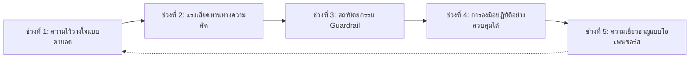
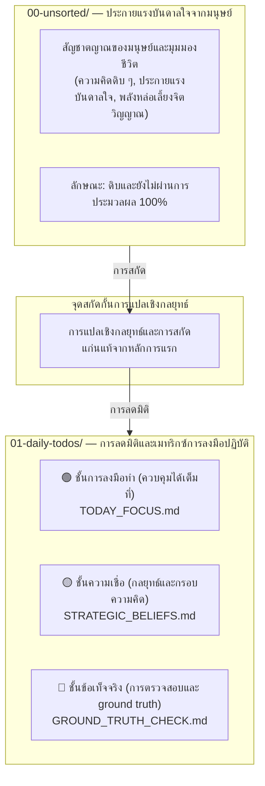

# 🛡️ "อย่าปล่อยให้ AI ทำงานนอกกรอบในโค้ดเบสของคุณ บังคับใช้ Plan-First Cognitive Guardrails ด้วย P-Gate."

> 🌐 **Languages**: [English](README.md) | [簡體中文](README_CN.md) | [繁體中文](README_ZH_TW.md) | [日本語](README_JA.md) | [한국어](README_KO.md) | [ภาษาไทย](README_TH.md) | [Bahasa Indonesia](README_ID.md) | [Tiếng Việt](README_VN.md)

### **Santenmoku P-Gate Protocol**

*กรอบกำกับความคิดระหว่างมนุษย์กับเครื่องจักร, จุดสกัดกั้นภาพหลอนของ AI และโปรโตคอลความปลอดภัยแบบ Zero-Trust สำหรับ AI Agents.*

> 🕊️ **Tolerance & Control**: ในบรรดาหลักการออกแบบ Big 4 ของเรา ข้อที่ 4 คือ **Tolerance**. AI Agent มีหน้าที่รับภาระของการลองผิดลองถูกและการลงมือปฏิบัติแทนมนุษย์ ไม่ใช่ทำให้มนุษย์ต้องแบกรับความตึงเครียดทางจิตใจ ด้วย P-Gate การควบคุมยังคงอยู่ในมือมนุษย์เสมอ!

## 🚀 เริ่มต้นอย่างรวดเร็ว: ปกป้องโค้ดเบสของคุณใน 30 วินาที

เลือกวิธีการติดตั้งที่เหมาะกับเวิร์กโฟลว์ของคุณ:

### ตัวเลือก A: ตัวบูตสแตรป CLI แบบบรรทัดเดียว (แนะนำ)
เรียกใช้ automated seed loader ในเทอร์มินัลของคุณเพื่อเลือกภาษาหลัก (EN, CN, ZH_TW, JA, KO, TH, ID, VN) และล็อกดาวน์ AI Agent ของคุณ:

```bash
./bin/seed-init.sh
# Or if using npm scripts:
npm run seed:init
```

---

## 🎯 P-Gate คืออะไร?

> 💡 **P-Gate (Plan-First & Cognitive Guardrail Protocol)**: เฟรมเวิร์กความปลอดภัยแบบ Zero-Trust และการป้องกันเชิงความคิดที่ออกแบบมาเพื่อการทำงานร่วมกันระหว่างมนุษย์กับ AI agents.

สำหรับนักพัฒนาและผู้ใช้ที่ยังไม่คุ้นกับโปรโตคอลนี้ **"P" ใน P-Gate หมายถึง 3 Core Pillars (The 3 Pillars of P)** ซึ่งออกแบบเป็นชั้น ๆ เพื่อคงไว้ซึ่งเจตนาและการควบคุมของมนุษย์:

1. **Plan-First**:
   * ปฏิเสธการแก้ไขของ AI ที่ไม่ได้ร้องขอหรือการแก้ไฟล์แบบเงียบ ๆ ทุกการเปลี่ยนแปลงสถานะต้องมีแผนการดำเนินงานที่มีโครงสร้างและได้รับการอนุมัติจากมนุษย์ก่อนจึงจะได้รับสิทธิ์เขียนข้อมูล
2. **Psychological Safety**:
   * ขจัดความกังวลด้วย Step 0 Pre-flight Snapshots ที่ย้อนกลับได้ 100% และทริกเกอร์หยุดชั่วคราวแบบทันที (`Esc` / `Hold, let me think.`) เพื่อให้มนุษย์มีอิสระในการทดลองอย่างเต็มที่โดยไม่มีความเสี่ยง
3. **P-Gate Cognitive Intercepts**:
   * บังคับใช้เกตการยืนยันหลายขั้นตอนอย่างเป็นโครงสร้าง (Lv.0 ถึง Lv.3) ณ จุดตัดสินใจสำคัญ (การเขียนสถานะ, การ deploy, และการลงนามด้วย hotkey) เพื่อให้เกิดการสอดคล้องกันอย่างแท้จริงระหว่างมนุษย์และเครื่องจักร

* **ไม่ใช่ตัวบล็อกแบบตายตัว**: P-Gate คือระบบความปลอดภัยเชิงจิตวิทยาที่ทำให้การตัดสินใจขั้นสุดท้ายยังคงอยู่ในมือมนุษย์ตลอดเวลา
* **การมอบหมายงานอย่างแท้จริง**: มันถ่ายโอนภาระทางจิตใจจากการลองผิดลองถูกไปยัง AI Agent และคืนพื้นที่การตัดสินใจที่สงบและคาดการณ์ได้กลับคืนสู่นักพัฒนา

---

## 🌊 บันไดที่ซ่อนอยู่: จากความไว้วางใจแบบตาบอดสู่ความเชี่ยวชาญที่ออกแบบได้

> *"ความก้าวหน้าไม่เคยเป็นเส้นตรง ระหว่าง 'Ignorance' และ 'Mastery' มีแนวปะการังที่ไม่ได้ทำแผนที่ของแรงเสียดทานทางความคิดในโลกจริงอยู่เสมอ."*

ทีมวิศวกรรมส่วนใหญ่มักเข้าใจผิดว่าการนำ AI มาใช้งานเป็นเพียงเส้นทางเชิงเส้น 3 ขั้นง่าย ๆ: **Ignorance ➔ Execution ➔ Mastery**.

ในความเป็นจริง วิศวกรรม AI ระดับ production ต้องอาศัยการฝ่าฟันผ่านห้าช่วงวิวัฒนาการสำคัญที่มักถูกมองข้าม:




---


### 🧗 5 ช่วงวิวัฒนาการของการปรับแนวมนุษย์-เอไอ

1. **ความไม่รู้ความสามารถของตนเอง (Blind Trust)**
  - *กับดัก*: ไว้วางใจ AI agents อย่างไร้เดียงสาโดยไม่มีข้อกำกับด้านความปลอดภัย และสมมติว่าเพียง prompt สั้น ๆ ก็จะได้โค้ด production ที่สมบูรณ์แบบ
2. **แรงเสียดทานทางความคิด (กำแพงแห่งความกังวล)**
  - *แรงเสียดทาน*: เผชิญกับภาพหลอนของ AI, การแก้ไขไฟล์ที่ไม่ได้ร้องขอ, แรงกดดันจากตัวนับถอยหลัง, และความกลัวอย่างต่อเนื่องว่าจะให้คำแนะนำที่ผิดพลาด
3. **สถาปัตยกรรม Guardrail (ขอบเขตและ Fail-Safe)**
  - *จุดตระหนักรู้*: ตระหนักว่ามีความจำเป็นที่ไม่อาจต่อรองได้สำหรับ Step 0 Git Pre-flight Snapshots, การบังคับใช้ Plan-First, และ P-Gate cognitive intercepts
4. **การลงมือปฏิบัติอย่างควบคุมได้ (คำสั่งที่คาดการณ์ได้)**
  - *ความเชี่ยวชาญ*: นำทาง AI agents ผ่านแผนการหลายขั้นตอนที่มีโครงสร้างได้อย่างราบรื่น พร้อมการควบคุมแบบ deterministic 100% และการย้อนกลับได้ทันที
5. **การทำให้เป็นผลิตภัณฑ์และความเชี่ยวชาญแบบโอเพนซอร์ส (ประโยชน์สาธารณะ)**
  - *จุดสูงสุด*: สกัดบทเรียนการต่อสู้ในโลกจริงที่เจ็บปวดให้กลายเป็นโปรโตคอลเชิงความคิดที่เป็นมาตรฐาน — เปลี่ยน guardrails ภายในให้กลายเป็นประโยชน์สาธารณะระดับโลกผ่าน **Santenmoku P-Gate Protocol**


## 🧬 ไปป์ไลน์แบบโต้ตอบมนุษย์สู่เครื่องจักร SilverVine

> 💡 **จากสัญชาตญาณดิบสู่การลงมือปฏิบัติที่ควบคุมได้**: วิธีที่ประกายความคิดของมนุษย์แปรเปลี่ยนเป็น ground truth ที่ผ่านการออกแบบผ่านจุดสกัดกั้นของ Santenmoku P-Gate




☕ กฎการควบคุมโดยมนุษย์และการหยุดชั่วคราว

💡 P-Gate Core Cognitive Barrier: ภายใต้ระบบ Santenmoku มนุษย์มี "อำนาจในการแก้ไขอย่างไม่จำกัด" คุณไม่จำเป็นต้องกังวลกับคำแนะนำที่ผิดพลาดเลย แม้แต่น้อย เพราะชั้นพื้นฐานของระบบมีการสำรองข้อมูลหลายชั้นและกลไกป้องกันแบบลดมิติ จึงรับประกันความทนทาน 100%!

🛡️ ตาข่ายนิรภัยด้านจิตวิทยาและความปลอดภัย 3 ชั้น

Zero Time Pressure:

คุณยังคงมีอำนาจควบคุมสูงสุดเสมอ หากคุณรู้สึกว่าความคิดของคุณยังไม่ชัดเจน หรือกังวลว่าอาจยังคิดไม่รอบคอบพอเมื่อเผชิญกับตัวนับถอยหลัง 5 นาทีหรือคำถามแบบ A/B แบบหลายตัวเลือก นี่เป็นเรื่องปกติอย่างยิ่ง อย่ารีบตัดสินใจ

Instant Freeze:

เพียงกด Esc หรือพิมพ์ "Hold, let me think." ในกล่องโต้ตอบ แล้ว AI Agent จะหยุดการดำเนินการทั้งหมดทันทีและเข้าสู่สถานะรอ

100% Reversible:

ระบบได้รับการรองรับด้วย Step 0 Git Pre-flight Snapshot ทำให้กู้คืนได้ในคลิกเดียวจากทุกขั้นตอน (git reset) และกำจัดความเสี่ยงของการลองผิดลองถูก

🤝 Human-in-the-Loop:

Automatic Fail-Safe Downgrade:

หากไม่มีการแทรกแซงหรือการสลับจากมนุษย์ภายในช่วงเวลานับถอยหลังที่กำหนด AI Agent จะทริกเกอร์การลดระดับอย่างปลอดภัยโดยอัตโนมัติ และบังคับสลับไปยัง Plan Mode โดยจะไม่แก้ไขโค้ดโดยพลการ

Perfect Co-Op Loop:

เครื่องจะเข้าสู่ Plan Mode ➔ สร้าง Plan ที่มีโครงสร้าง ➔ มนุษย์อนุมัติ ➔ เครื่องเริ่มดำเนินการอย่างแม่นยำ
