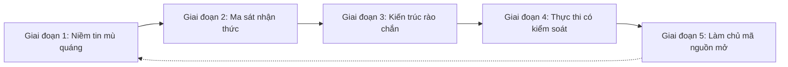
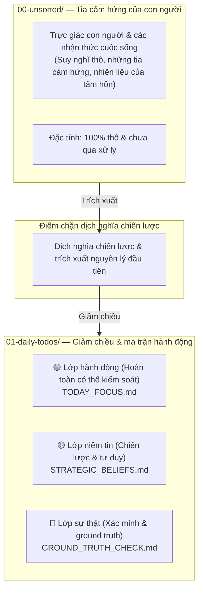

# 🛡️ "Đừng để AI chạy loạn trong codebase của bạn. Hãy thực thi các rào chắn nhận thức Plan-First với P-Gate."

> 🌐 **Languages**: [English](README.md) | [簡體中文](README_CN.md) | [繁體中文](README_ZH_TW.md) | [日本語](README_JA.md) | [한국어](README_KO.md) | [ภาษาไทย](README_TH.md) | [Bahasa Indonesia](README_ID.md) | [Tiếng Việt](README_VN.md)

### **Santenmoku P-Gate Protocol**

*Rào chắn nhận thức người-máy, cơ chế chặn ảo giác & giao thức an toàn zero-trust cho các AI Agent.*

> 🕊️ **Khoan dung & Kiểm soát**: Trong bốn nguyên tắc thiết kế lớn của chúng ta, nguyên tắc thứ 4 là **Khoan dung**. AI Agent tồn tại để hấp thụ chi phí thử và sai cũng như gánh nặng thực thi thay cho con người, chứ không phải để đặt họ dưới áp lực tinh thần. Với P-Gate, quyền kiểm soát luôn ở trong tay con người!

## 🚀 Khởi động nhanh: Cách bảo vệ codebase của bạn trong 30 giây

Chọn phương thức triển khai phù hợp với quy trình làm việc của bạn:

### Option A: Trình bootstrap CLI một dòng (Khuyến nghị)
Chạy bộ nạp seed tự động trong terminal để chọn ngôn ngữ chính của bạn (EN, CN, ZH_TW, JA, KO, TH, ID, VN) và khóa chặt AI Agent của bạn:

```bash
./bin/seed-init.sh
# Or if using npm scripts:
npm run seed:init
```

---

## 🎯 P-Gate là gì?

> 💡 **P-Gate (Plan-First & Cognitive Guardrail Protocol)**: Một khung an toàn zero-trust và phòng thủ nhận thức được thiết kế cho sự cộng tác giữa con người và AI agent.

Đối với các developer và người dùng mới với giao thức này, chữ **"P" trong P-Gate đại diện cho 3 Trụ cột Cốt lõi (The 3 Pillars of P)**, được thiết kế theo từng lớp để bảo toàn ý định và quyền kiểm soát của con người:

1. **Plan-First**:
   * Từ chối mọi biến đổi AI không được yêu cầu hoặc chỉnh sửa tệp âm thầm. Mọi thay đổi trạng thái đều phải có một kế hoạch thực thi có cấu trúc và được con người phê duyệt trước khi cấp quyền ghi.
2. **An toàn tâm lý**:
   * Loại bỏ lo âu bằng Step 0 Git Pre-flight Snapshots có thể hoàn nguyên 100% và các cơ chế đóng băng tức thời (`Esc` / `Hold, let me think.`), trao cho con người quyền tự do tuyệt đối để thử nghiệm mà không có rủi ro.
3. **Các cổng chặn nhận thức của P-Gate**:
   * Thực thi các cổng xác nhận nhiều giai đoạn có cấu trúc (Lv.0 đến Lv.3) tại các điểm quyết định trọng yếu (ghi trạng thái, triển khai và ký bằng phím tắt) để bảo đảm sự đồng bộ thực sự giữa con người và máy.

* **Không phải một bộ chặn cứng nhắc**: P-Gate là một lưới an toàn tâm lý, bảo đảm chủ quyền luôn vĩnh viễn nằm trong tay con người.
* **Ủy quyền thực sự**: Nó gánh phần áp lực tinh thần của quá trình thử và sai sang cho AI Agent, trả lại cho developer một không gian ra quyết định bình tĩnh và tất định.

---

## 🌊 Những nấc thang ẩn giấu: Từ niềm tin mù quáng đến năng lực được thiết kế

> *"Tiến bộ chưa bao giờ là một đường thẳng. Giữa 'Vô minh' và 'Làm chủ' là những rạn san hô chưa được bản đồ hóa của ma sát nhận thức trong thế giới thực."*

Phần lớn các đội kỹ thuật ngây thơ cho rằng việc áp dụng AI đi theo một lộ trình tuyến tính 3 bước đơn giản: **Vô minh ➔ Thực thi ➔ Làm chủ**.

Trên thực tế, kỹ thuật AI ở cấp độ production đòi hỏi phải đi qua năm giai đoạn tiến hóa quan trọng, thường bị bỏ sót:




---


### 🧗 5 Giai đoạn Tiến hóa của Sự đồng bộ Người-AI

1. **Vô thức bất năng (Niềm tin mù quáng)**
  - *Cạm bẫy*: Tin ngây thơ vào AI agent mà không có ràng buộc an toàn, cho rằng chỉ cần một prompt đơn giản là sẽ có ngay mã production hoàn hảo.
2. **Ma sát nhận thức (Bức tường lo âu)**
  - *Ma sát*: Trải nghiệm ảo giác của AI, các sửa đổi tệp không được yêu cầu, áp lực từ bộ đếm thời gian, và nỗi sợ thường trực khi đưa ra hướng dẫn sai.
3. **Kiến trúc rào chắn (Biên giới & cơ chế fail-safe)**
  - *Khai ngộ*: Nhận ra nhu cầu không thể thương lượng đối với Step 0 Git Pre-flight Snapshots, cơ chế thực thi Plan-First, và các cổng chặn nhận thức của P-Gate.
4. **Thực thi có kiểm soát (Lệnh gọi dự đoán được)**
  - *Làm chủ*: Dẫn dắt AI agent một cách trơn tru qua các kế hoạch nhiều bước có cấu trúc với khả năng kiểm soát tất định 100% và hoàn nguyên tức thì.
5. **Sản phẩm hóa & làm chủ mã nguồn mở (Lợi ích công cộng)**
  - *Đỉnh cao*: Trừu tượng hóa những bài học chiến trường khắc nghiệt trong thế giới thực thành các giao thức nhận thức chuẩn hóa — biến các rào chắn nội bộ thành lợi ích công cộng toàn cầu thông qua **Santenmoku P-Gate Protocol**.


## 🧬 Quy trình pipeline tương tác Người-Máy SilverVine

> 💡 **Từ trực giác thô đến thực thi có kiểm soát**: Cách tia lửa của con người được chuyển hóa thành ground truth được thiết kế thông qua các cổng chặn của Santenmoku P-Gate.




☕ Quy tắc Human Control & Freeze

💡 Rào cản nhận thức cốt lõi của P-Gate: Trong hệ thống Santenmoku, con người sở hữu "quyền sửa sai không giới hạn." Bạn hoàn toàn không cần sợ hướng dẫn sai; các lớp nền tảng của hệ thống có nhiều lớp dự phòng và cơ chế phòng thủ giảm chiều, bảo đảm khả năng khoan dung 100%!

🛡️ Ba lớp bảo vệ tâm lý & an toàn

Zero Time Pressure:

Bạn luôn nắm toàn quyền kiểm soát. Nếu bạn cảm thấy suy nghĩ của mình chưa rõ ràng hoặc lo rằng mình chưa suy nghĩ đủ kỹ khi đối mặt với bộ đếm thời gian 5 phút hay một câu hỏi trắc nghiệm A/B, điều đó hoàn toàn bình thường. Đừng vội đưa ra quyết định hấp tấp.

Instant Freeze:

Chỉ cần nhấn Esc hoặc gõ "Hold, let me think." trong hộp thoại, AI Agent sẽ ngay lập tức đóng băng toàn bộ thực thi và chuyển sang trạng thái chờ.

100% Reversible:

Hệ thống được hỗ trợ bởi Step 0 Git Pre-flight Snapshot, bảo đảm khôi phục chỉ bằng một cú nhấp từ bất kỳ bước nào (`git reset`), loại bỏ rủi ro của quá trình thử và sai.

🤝 Human-in-the-Loop:

Automatic Fail-Safe Downgrade:

Nếu không có sự can thiệp hoặc chuyển chế độ của con người trong khoảng thời gian đếm ngược đã chỉ định, AI Agent sẽ tự động kích hoạt một mức hạ an toàn, cưỡng bức chuyển sang Plan Mode, không bao giờ tự ý sửa đổi mã.

Perfect Co-Op Loop:

Máy tự động đi vào Plan Mode ➔ tạo ra một Plan có cấu trúc ➔ con người phê duyệt ➔ máy bắt đầu thực thi chính xác.
