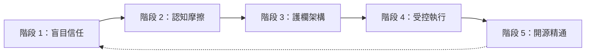
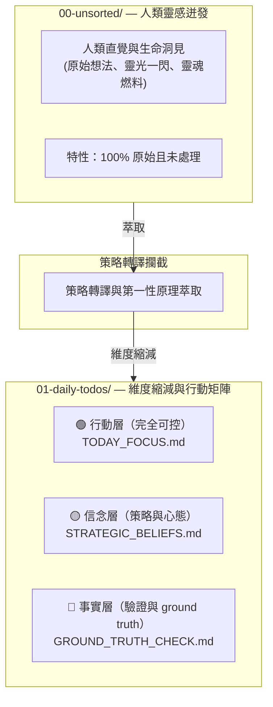

# 🛡️「別讓 AI 在你的程式碼庫裡失控。用 P-Gate 落實 Plan-First 認知護欄。」

> 🌐 **Languages**: [English](README.md) | [簡體中文](README_CN.md) | [繁體中文](README_ZH_TW.md) | [日本語](README_JA.md) | [한국어](README_KO.md) | [ภาษาไทย](README_TH.md) | [Bahasa Indonesia](README_ID.md) | [Tiếng Việt](README_VN.md)

### **Santenmoku P-Gate Protocol**

*人機認知護欄、幻覺攔截與零信任安全協議，專為 AI 代理而設。*

> 🕊️ **容忍與控制**：在我們的 Big 4 設計原則中，第 4 項是 **容忍**。AI Agent 的存在，是為了替人類承擔試錯與執行的成本，而不是讓人承受心理壓力。使用 P-Gate 時，控制權始終保留在人類手中！

> 🖥️ **互動式實體 UI Demo**：直接在瀏覽器中體驗 4 階認知攔截 HUD 畫面：
> 👉 **[啟動 Santenmoku P-Gate HUD Demo (`docs/p-gate-demo.html`)](./docs/p-gate-demo.html)**

## 🚀 快速開始：30 秒內保護你的程式碼庫

選擇最符合你工作流程的部署方式：

### 選項 A：一行 CLI 啟動器（推薦）
在終端機中執行自動化種子載入器，選擇你的主要語言（EN、CN、ZH_TW、JA、KO、TH、ID、VN），並為你的 AI Agent 上鎖：

```bash
./bin/seed-init.sh
# 或者如果你使用 npm scripts：
npm run seed:init
```

---

## 🎯 什麼是 P-Gate？

> 💡 **P-Gate（Plan-First & Cognitive Guardrail Protocol）**：為人類與 AI 代理協作所打造的零信任安全與認知防禦框架。

對於剛接觸此協議的開發者與使用者而言，P-Gate 中的 **"P"** 代表 3 個核心支柱（The 3 Pillars of P），以逐層防護的方式保存人類意圖與控制權：

1. **Plan-First**：
   * 拒絕未經請求的 AI 變更或靜默檔案編輯。任何狀態變更都必須先有結構化的執行計畫，並在取得人類核准後，才授與寫入權限。
2. **心理安全**：
   * 透過 100% 可逆的 Step 0 Pre-flight Snapshots，以及即時 freeze 觸發（`Esc` / `Hold, let me think.`），消除焦慮，讓人類能毫無風險地放心嘗試。
3. **P-Gate 認知攔截**：
   * 在關鍵決策檢查點（狀態寫入、部署與熱鍵簽署）實施結構化的多階段確認門檻（Lv.0 到 Lv.3），確保真正的人機對齊。

* **不是僵硬的阻擋器**：P-Gate 是一張心理安全網，確保主導權永遠保留在人類手中。
* **真正的委派**：它把試錯所帶來的心理負擔卸載給 AI Agent，將平靜且可預測的決策空間還給開發者。

---

## 🌊 隱藏階梯：從盲目信任到工程化精通

> *「進步從來不是直線。在『無知』與『精通』之間，橫亙著真實世界裡那些未被標記的認知摩擦暗礁。」*

多數工程團隊天真地以為，AI 導入只會沿著一條簡單的三步線性路徑前進：**無知 ➔ 執行 ➔ 精通**。

但在現實中，生產級 AI 工程必須穿越五個關鍵、而且常被忽略的演化階段：




---


### 🧗 人機對齊的 5 個演化階段

1. **無意識的不勝任（Blind Trust）**
  - *陷阱*：天真地信任 AI Agent，卻沒有任何安全約束，以為只要一個 prompt 就能產出完美的 production code。
2. **認知摩擦（焦慮之牆）**
  - *摩擦*：遭遇 AI 幻覺、未經請求的檔案變更、倒數計時壓力，以及對提出錯誤指引的持續恐懼。
3. **護欄架構（邊界與失效保護）**
  - *頓悟*：意識到 Step 0 Git Pre-flight Snapshots、Plan-First 強制執行，以及 P-Gate 認知攔截，是不可妥協的必要條件。
4. **受控執行（可預測的命令）**
  - *精通*：以 100% 決定性控制與即時可逆性，無縫引導 AI Agent 完成結構化的多步驟計畫。
5. **產品化與開源精通（公共利益）**
  - *巔峰*：將痛苦但真實的實戰經驗抽象為標準化認知協議，透過 **Santenmoku P-Gate Protocol** 把內部護欄轉化為全球公共利益。


## 🧬 SilverVine 人機互動管線

> 💡 **從原始直覺到受控執行**：人類的靈光如何透過 Santenmoku P-Gate 攔截，轉化為工程化的 ground truth。




☕ 人類控制與 Freeze 規則

💡 P-Gate 的核心認知屏障：在 Santenmoku 系統中，人類擁有「無限修正權」。你完全沒有必要害怕錯誤指引；系統底層具備多重備援與維度縮減防禦，能確保 100% 的容忍度！

🛡️ 三重心理與安全保護網

零時間壓力：

你始終擁有最終控制權。如果面對 5 分鐘倒數計時，或是 A/B 多選題時，覺得自己的想法還不夠清晰，或者擔心自己沒有思考得足夠周全，這都非常正常。請不要倉促做決定。

即時 Freeze：

只要在對話框中按下 Esc，或輸入 "Hold, let me think."，AI Agent 就會立即凍結所有執行並進入等待狀態。

100% 可逆：

系統以 Step 0 Git Pre-flight Snapshot 為後盾，確保可以透過一步（git reset）從任何步驟恢復，消除試錯風險。

🤝 人類在迴路中：

自動失效保護降級：

如果在指定的倒數計時內沒有任何人類介入或切換，AI Agent 將自動觸發安全降級，強制切換到 Plan Mode，絕不任意修改程式碼。

完美協作迴圈：

機器會自動進入 Plan Mode ➔ 產生結構化的 Plan ➔ 人類核准 ➔ 機器開始精確執行。
